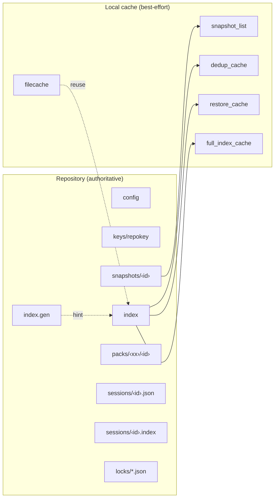
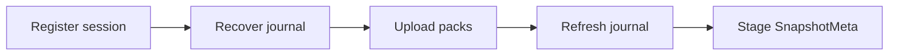
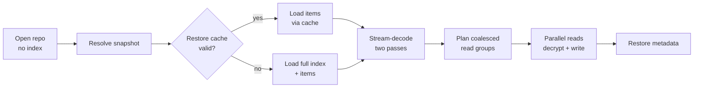
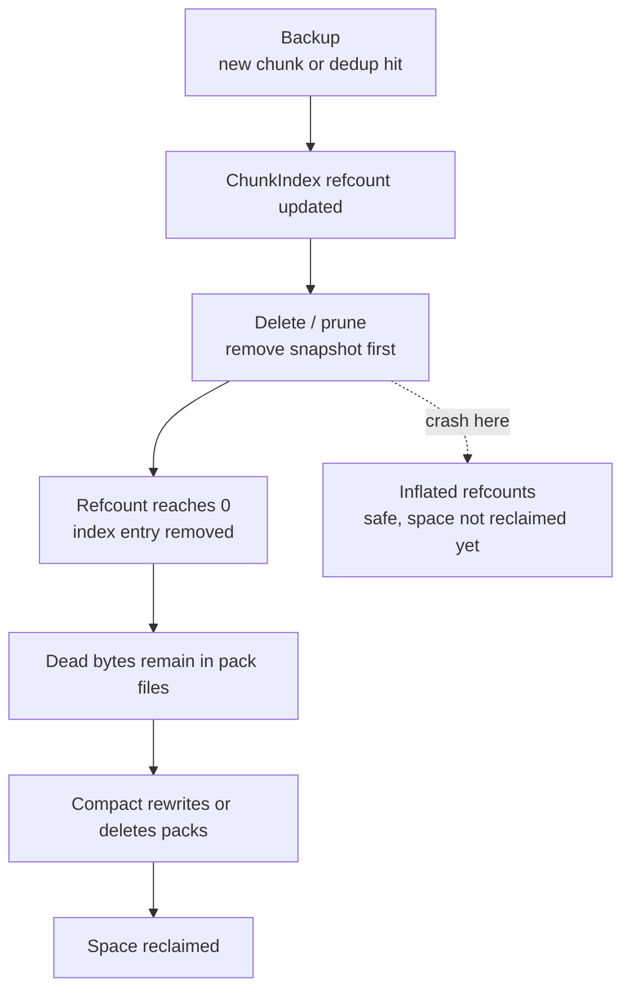
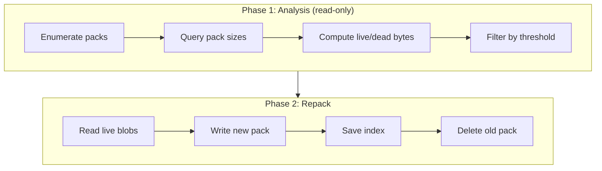
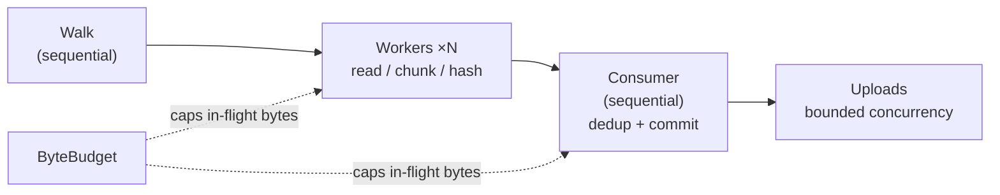

# Architecture

Technical reference for vykar's cryptographic, chunking, compression, concurrency, and repository-layout design decisions.

---

## Cryptography

### Encryption

AEAD with 12-byte random nonces (`AES-256-GCM` or `ChaCha20-Poly1305`).

Rationale:
- Authenticated encryption with modern, audited constructions
- `auto` mode benchmarks `AES-256-GCM` vs `ChaCha20-Poly1305` at init and stores one concrete mode per repo
- Strong performance across mixed CPU capabilities (AES acceleration and non-AES acceleration)
- 32-byte symmetric keys (simpler key management than split-key schemes)
- AEAD AAD always includes the 1-byte type tag; for identity-bound objects it also includes a domain-separated object context (for example: `index`, snapshot ID, chunk ID, `filecache`, or `snapshot_cache`)

**Key usage model:** The master `encryption_key` is used directly as the AEAD symmetric key for all encryption operations throughout the lifetime of the repository. There is no per-session or per-snapshot key derivation. Cryptographic isolation between objects relies on random 12-byte nonces (unique per encryption call) and domain-separated AAD (binding ciphertext to object type and identity). With 96-bit random nonces, the birthday-bound collision threshold is approximately 2^48 encryptions under a single key — well beyond realistic backup workloads.

### Plaintext Mode (`none`)

When `encryption` is set to `none`, vykar uses a `PlaintextEngine` — an identity transform where `encrypt()` and `decrypt()` return data unchanged. AAD is ignored (there is no AEAD construction to bind it to). The format layer detects plaintext mode via `is_encrypting() == false` and uses the shorter wire format: `[1-byte type_tag][plaintext]` (1-byte overhead instead of 29 bytes).

This mode does **not** provide authentication or tamper protection — it is designed for trusted storage where confidentiality is unnecessary. Data integrity against accidental corruption is still provided via keyed BLAKE2b-256 chunk IDs (see [Hashing / Chunk IDs](#hashing--chunk-ids) below).

### Key Derivation

The master key (64 bytes: 32-byte encryption key + 32-byte chunk ID key) is generated from OS entropy (`OsRng`) at repository init. It is never derived from the passphrase. Instead, the passphrase is used to derive a Key Encryption Key (KEK) via Argon2id, and the KEK wraps the master key with AES-256-GCM. The encrypted master key blob is stored at `keys/repokey` alongside the KDF parameters (algorithm, memory/time/parallelism costs, salt) and the wrapping nonce. Changing the passphrase re-wraps the same master key without re-encrypting any repository data.

Rationale:
- Two-layer scheme (random data key, passphrase-derived wrapping key) separates key strength from passphrase quality
- Argon2id is a modern memory-hard KDF recommended by OWASP and IETF
- Resists both GPU and ASIC brute-force attacks

In `none` mode no passphrase or key file is needed. The `chunk_id_key` is deterministically derived as `BLAKE2b-256(repo_id)`. Since `repo_id` is stored unencrypted in the repo `config`, this key is not secret — it exists only so that the same keyed hashing path is used in all modes. No `keys/repokey` file is created.

### Hashing / Chunk IDs

Keyed BLAKE2b-256 MAC using a `chunk_id_key` derived from the master key.

Rationale:
- Prevents content confirmation attacks (an adversary cannot check whether known plaintext exists in the backup without the key)
- BLAKE2b is faster than SHA-256 in pure software implementations (on CPUs with hardware SHA-256 acceleration — SHA-NI on x86, SHA extensions on ARM — hardware SHA-256 can be faster; BLAKE2b was chosen for consistent performance across all architectures without requiring hardware-specific instruction sets)
- Trade-off: keyed IDs prevent dedup across different encryption keys (acceptable for vykar's single-key-per-repo model)

In `none` mode the same keyed BLAKE2b-256 construction is used, but the key is derived from the public `repo_id` rather than a secret master key. The MAC therefore acts as a **checksum for corruption detection**, not as authentication against tampering. `vykar check --verify-data` recomputes chunk IDs and compares them to detect bit-rot or storage corruption — this works identically across all encryption modes.

---

## Content Processing

### Chunking

FastCDC (content-defined chunking) via the `fastcdc` v3 crate.

Default parameters: 512 KiB min, 2 MiB average, 8 MiB max (configurable in YAML).
`chunker.max_size` is hard-capped at 16 MiB during config validation.

Rationale:
- Newer algorithm, benchmarks faster than Rabin fingerprinting
- Good deduplication ratio with configurable chunk boundaries

### Compression

Per-chunk compression with a 1-byte tag prefix. Supported algorithms: LZ4, ZSTD, and None. The tag identifies the codec only, not the compression level — the ZSTD level is a repo-wide configuration setting. Recompression at a different level requires decompressing and recompressing every chunk.

Rationale:
- Per-chunk tags allow mixing algorithms within a single repository
- LZ4 for speed-sensitive workloads, ZSTD for better compression ratios. LZ4 is recommended over None for most workloads — even on incompressible data the overhead is negligible, and the reduced I/O and transfer size typically more than compensate
- No repository-wide format version lock-in for compression choice
- ZSTD compression reuses a thread-local compressor context per level, reducing allocation churn in parallel backup paths
- Decompression enforces a hard output cap (32 MiB) to bound memory usage and mitigate decompression-bomb inputs

### Deduplication

Content-addressed deduplication uses keyed `ChunkId` values (BLAKE2b-256 MAC). Identical plaintext produces the same `ChunkId`, so the second copy is not stored; only refcounts are incremented.

vykar supports three index modes for dedup lookups:

1. **Full index mode** — in-memory `ChunkIndex` (`HashMap<ChunkId, ChunkIndexEntry>`)
2. **Dedup-only mode** — lightweight `DedupIndex` (`ChunkId -> stored_size`) plus `IndexDelta` for mutations
3. **Tiered dedup mode** — `TieredDedupIndex`:
   - session-local HashMap for new chunks in the current backup
   - Xor filter (`xorf::Xor8`) as probabilistic negative check
   - mmap-backed on-disk dedup cache for exact lookup

During backup, `enable_tiered_dedup_mode()` is used by default. If the mmap cache is missing/stale/corrupt, vykar safely falls back to dedup-only HashMap mode.

**Two-level dedup check** (in `Repository::bump_ref_if_exists`):
1. **Persistent dedup tier** — full index, dedup-only index, or tiered dedup index (depending on mode)
2. **Pending pack writers** — blobs buffered in data/tree `PackWriter`s that have not yet been flushed

This prevents duplicates both across backups and within a single backup run.

---

## Serialization

All persistent data structures use **msgpack** via `rmp_serde`. Structs serialize as **positional arrays** (not named-field maps) for compactness. This means field order matters — adding or removing fields requires careful versioning, and `#[serde(skip_serializing_if)]` must not be used on `Item` fields (it would break positional deserialization of existing data).

### RepoObj Envelope

Every repo object and local encrypted cache blob uses the same `RepoObj` envelope (`repo/format.rs`). The wire format depends on the encryption mode:

```text
Encrypted:  [1-byte type_tag][12-byte nonce][ciphertext + 16-byte AEAD tag]
Plaintext:  [1-byte type_tag][plaintext]
```

The type tag identifies the object kind via the `ObjectType` enum:

| Tag | ObjectType | Used for |
|-----|------------|----------|
| 0 | Config | Repository configuration (stored unencrypted) |
| 1 | Manifest | Legacy manifest object tag (unused in v2 repositories) |
| 2 | SnapshotMeta | Per-snapshot metadata |
| 3 | ChunkData | Compressed file/item-stream chunks |
| 4 | ChunkIndex | Encrypted `IndexBlob` stored at `index` |
| 5 | PackHeader | Reserved legacy tag (current pack files have no trailing header object) |
| 6 | FileCache | Local file-level cache (inode/mtime skip) |
| 7 | PendingIndex | Transient crash-recovery journal |
| 8 | SnapshotCache | Local snapshot-list cache |

The type tag byte is always included in AAD (authenticated additional data). For identity-bound objects, AAD also includes a domain-separated object context, binding ciphertext to both object type and identity (for example, `ChunkData` to its `ChunkId`, `SnapshotMeta` to snapshot ID, `ChunkIndex` to `b"index"`, `FileCache` to `b"filecache"`, and `SnapshotCache` to `b"snapshot_cache"`).

---

## Repository Format

### On-Disk Layout

`RepoConfig.version = 2` describes the current repository layout.

```text
<repo>/
|- config                    # Repository metadata (unencrypted msgpack)
|- keys/repokey              # Encrypted master key (Argon2id-wrapped; absent in `none` mode)
|- index                     # Encrypted IndexBlob { generation, chunks }
|- index.gen                 # Unencrypted advisory u64 generation hint
|- snapshots/<id>            # Encrypted snapshot metadata; source of truth for snapshot listing
|- sessions/<id>.json        # Session presence markers (concurrent backups)
|- sessions/<id>.index       # Per-session crash-recovery journals (absent after clean backup)
|- packs/<xx>/<pack-id>      # Pack files containing compressed+encrypted chunks (256 shard dirs)
`- locks/                    # Advisory lock files
```

### Local Optimization Caches (Client Machine)

These files live under a per-repo local cache root. By default this is the platform cache directory + `vykar` (for example, `~/.cache/vykar/<repo_id_hex>/...` on Linux, `~/Library/Caches/vykar/<repo_id_hex>/...` on macOS). If `cache_dir` is set in config, that path becomes the cache root. These are optimization artifacts, not repository source of truth.

```text
<cache>/<repo_id_hex>/
|- filecache                 # File metadata -> cached ChunkRefs
|- snapshot_list             # Snapshot ID -> SnapshotEntry cache
|- dedup_cache               # Sorted ChunkId -> stored_size (mmap + xor filter)
|- restore_cache             # Sorted ChunkId -> pack_id, pack_offset, stored_size (mmap)
`- full_index_cache          # Sorted full index rows for local rehydration/cache rebuilds
```

The index caches are validated against the current index generation. The authenticated source of truth is `IndexBlob.generation` inside `index`; `index.gen` is only an advisory hint used to avoid unnecessary remote index downloads on read paths. A stale or missing sidecar causes cache misses or full-index fallback, not correctness issues.

The `snapshot_list` cache is separate: on open/refresh, the client lists `snapshots/`, removes stale local entries, loads only new snapshot blobs, and persists the resulting snapshot list locally. This avoids O(n) snapshot metadata GETs on every open.

The same per-repo cache root is also used as the preferred temp location for intermediate files (e.g. cache rebuilds).

#### Repository And Cache Topology



### Key Data Structures

**IndexBlob** — the encrypted object stored at the `index` key. It combines the current cache-validity token with the chunk index.

| Field | Type | Description |
|-------|------|-------------|
| generation | u64 | Authenticated cache-validity token rotated when the index changes |
| chunks | ChunkIndex | Full chunk-to-pack mapping |

**ChunkIndex** — `HashMap<ChunkId, ChunkIndexEntry>`, persisted inside `IndexBlob`. The central lookup table for deduplication, restore, and compaction.

| Field | Type | Description |
|-------|------|-------------|
| refcount | u32 | Number of snapshots referencing this chunk |
| stored_size | u32 | Size in bytes as stored (compressed + encrypted) |
| pack_id | PackId | Which pack file contains this chunk |
| pack_offset | u64 | Byte offset within the pack file |

**Manifest** — runtime-only in-memory snapshot list derived from `snapshots/` and the local `snapshot_list` cache. It is not persisted to repository storage.

| Field | Type | Description |
|-------|------|-------------|
| version | u32 | Format version (currently 1) |
| timestamp | DateTime | Last modification time |
| snapshots | Vec\<SnapshotEntry\> | One entry per snapshot |

**SnapshotListCache** — local encrypted map from snapshot ID hex to `SnapshotEntry`. It is refreshed incrementally from `snapshots/` and exists only to avoid repeatedly downloading every snapshot blob on open.

Each `SnapshotEntry` contains: `name`, `id` (32-byte random), `time`, `source_label`, `label`, `source_paths`, `hostname`.

**SnapshotMeta** — per-snapshot metadata stored at `snapshots/<id>`.

| Field | Type | Description |
|-------|------|-------------|
| name | String | User-provided snapshot name |
| hostname | String | Machine that created the backup |
| username | String | User that ran the backup |
| time / time_end | DateTime | Backup start and end timestamps |
| chunker_params | ChunkerConfig | CDC parameters used for this snapshot |
| comment | String | Optional snapshot comment field; currently written as `""` by backup flows |
| item_ptrs | Vec\<ChunkId\> | Chunk IDs containing the serialized item stream |
| stats | SnapshotStats | File count, original/compressed/deduplicated sizes |
| source_label | String | Config label for the source |
| source_paths | Vec\<String\> | Directories that were backed up |
| label | String | Legacy compatibility field; new snapshots currently write `""` |

**SnapshotStats** — per-snapshot counters stored inside `SnapshotMeta.stats`.

| Field | Type | Description |
|-------|------|-------------|
| nfiles | u64 | Number of backed-up regular files plus command-dump virtual files |
| original_size | u64 | Total plaintext bytes before compression/dedup |
| compressed_size | u64 | Total bytes after compression |
| deduplicated_size | u64 | Bytes newly stored after deduplication |
| errors | u64 | Number of soft file-read errors skipped during backup |

`deduplicated_size` records the bytes newly stored at the time the snapshot was created. It depends on the global repository state at that moment and becomes stale if other snapshots are later deleted — a snapshot that originally shared all its chunks (showing `deduplicated_size ≈ 0`) may become the sole owner of those chunks after the other snapshot is removed. Treat this field as a creation-time accounting metric, not a durable measure of a snapshot's unique storage footprint.

**Item** — a single filesystem entry within a snapshot's item stream.

| Field | Type | Description |
|-------|------|-------------|
| path | String | Relative path within the backup |
| entry_type | ItemType | `RegularFile`, `Directory`, or `Symlink` |
| mode | u32 | Unix permission bits |
| uid / gid | u32 | Owner and group IDs |
| user / group | Option\<String\> | Owner and group names |
| mtime | i64 | Modification time (nanoseconds since epoch) |
| atime / ctime | Option\<i64\> | Access and change times |
| size | u64 | Original file size |
| chunks | Vec\<ChunkRef\> | Content chunks (regular files only) |
| link_target | Option\<String\> | Symlink target |
| xattrs | Option\<HashMap\> | Extended attributes |

**ChunkRef** — reference to a stored chunk, used in `Item.chunks`:

| Field | Type | Description |
|-------|------|-------------|
| id | ChunkId | Content-addressed chunk identifier |
| size | u32 | Uncompressed (original) size |
| csize | u32 | Stored size (compressed + encrypted) |

`csize` is stored per-reference so the restore path can pass it as a size hint to the ZSTD bulk decompressor, avoiding the overhead of a streaming decoder. Without it, each chunk decompression would either need an index lookup or fall back to the slower streaming path.

### Pack Files

Chunks are grouped into **pack files** (~32 MiB) instead of being stored as individual files. This reduces file count by 1000x+, critical for cloud storage costs (fewer PUT/GET ops) and filesystem performance (fewer inodes).

#### Pack File Format

```text
[8B magic "VGERPACK"][1B version=1]
[4B blob_0_len LE][blob_0_data]
[4B blob_1_len LE][blob_1_data]
...
[4B blob_N_len LE][blob_N_data]
```

- **Per-blob length prefix** (4 bytes): enables forward scanning of all blobs from byte 9 to EOF
- Each blob is a complete RepoObj envelope: `[1B type_tag][12B nonce][ciphertext+16B AEAD tag]`
- Each blob is independently encrypted (can read one chunk without decrypting the whole pack)
- No trailing per-pack header object — the chunk index already records which blobs reside in which pack at which offset, making a per-pack blob manifest redundant. Pack analysis for compaction enumerates blobs by forward-scanning length prefixes. Trade-off: if the index is lost, rebuilding requires a full sequential scan of all pack data (reading every byte); a trailing header would allow reading just the last N bytes per pack. In practice index loss is rare (single encrypted blob, written atomically) and `check --verify-data` already performs a full pack scan
- Pack ID = unkeyed BLAKE2b-256 of entire pack contents, stored at `packs/<shard>/<hex_pack_id>`

#### Data Packs vs Tree Packs

Two separate `PackWriter` instances:
- **Data packs** — file content chunks. Dynamic target size. Assembled in heap `Vec<u8>` buffers.
- **Tree packs** — item-stream metadata. Fixed at `min(min_pack_size, 4 MiB)` and assembled in heap `Vec<u8>` buffers.

#### Dynamic Pack Sizing

Pack sizes grow with repository size. Config exposes floor and ceiling:

```yaml
repositories:
  - url: /backups/repo
    min_pack_size: 33554432     # 32 MiB (floor, default)
    max_pack_size: 201326592    # 192 MiB (default)
```

Data pack sizing formula:
```text
target = clamp(min_pack_size * sqrt(num_data_packs / 50), min_pack_size, max_pack_size)
```

`max_pack_size` has a hard ceiling of **512 MiB**. Values above that are rejected at repository init/open.

| Data packs in repo | Target pack size |
|--------------------|------------------|
| < 50               | 32 MiB (floor)   |
| 200                | 64 MiB           |
| 800                | 128 MiB          |
| 1,800+             | 192 MiB (default cap) |

If you raise `max_pack_size`, target size can grow further, up to the 512 MiB hard ceiling.

`num_data_packs` is computed at `open()` by counting distinct `pack_id` values in the ChunkIndex (zero extra I/O). During a backup session, the target is recalculated after each data-pack flush, so the first large backup benefits from scaling immediately.

---

## Data Flow

### Backup Pipeline

The backup runs in two phases so multiple clients can upload concurrently (see [Concurrent Multi-Client Backups](#concurrent-multi-client-backups)).

#### Phase 1: Upload (no exclusive lock)



```text
generate session_id (128-bit random hex)
register_session() → write sessions/<session_id>.json, probe for active lock
open repo (full index loaded once)
begin_write_session(session_id) → journal key = sessions/<session_id>.index
  → prune stale local file-cache entries
  → recover own sessions/<session_id>.index if present (batch-verify packs, promote into dedup structures)
  → enable tiered dedup mode (mmap cache + xor filter, fallback to dedup HashMap)
  → derive upload/pipeline limits from `limits.connections` + `limits.threads`
  → execute `command_dumps` first:
    → stream each command's stdout directly into chunk storage
    → add virtual items under `.vykar-dumps/` to the item stream
    → abort backup on non-zero exit or timeout
  → walk sources with excludes + one_file_system + exclude_if_present
    → cache-hit path: reuse cached ChunkRefs and bump refs
    → cache-miss path:
      → pipeline path (if effective worker threads > 1):
        → walk emits regular files and segmented large files
          (segmentation applies when file_size > 64 MiB;
           segment size is min(64 MiB, pipeline_buffer_bytes))
        → worker threads read/chunk/hash and classify each chunk:
          - xor prefilter says "maybe present" → hash-only chunk
          - xor prefilter miss (or no filter) → compress + encrypt prepacked chunk
        → sequential consumer validates segment order, performs dedup checks
          (persistent dedup tier + pending pack writers), commits new chunks,
          and handles xor false positives via inline transform
        → ByteBudget enforces pipeline_buffer_bytes as a hard in-flight memory cap
          (64 MiB × effective threads, clamped to 64 MiB..1 GiB)
      → sequential fallback path (effective worker threads == 1)
  → serialize items incrementally into item-stream chunks (tree packs)
  → pack SnapshotMeta in memory (do not write snapshots/<id> yet)
```

#### Phase 2: Commit (exclusive lock, brief)


```text
acquire_lock_with_retry(10 attempts, 500ms base, exponential backoff + jitter)
commit_concurrent_session():
  → flush packs/pending uploads (pack flush triggers: target size, 10,000 blobs, or 300s age)
  → refresh snapshot list from snapshots/ (via local snapshot cache diff)
  → check snapshot name uniqueness against fresh list
  → if delta is non-empty:
      → reload full index from storage
      → delta.reconcile(fresh_index): new_entries already present → refcount bumps;
        missing bump targets → Err(StaleChunksDuringCommit)
      → verify_delta_packs on reconciled delta
      → apply reconciled delta to fresh index
      → persist IndexBlob + advisory index.gen
  → if delta is empty but local dedup caches need rebuilding:
      → reload full index from storage for cache rebuild
  → write snapshots/<id> (commit point)
  → rebuild local dedup/restore/full-index caches as needed
  → update in-memory manifest
  → persist local file cache
deregister_session() → delete sessions/<session_id>.json (while holding lock)
release_lock()
clear sessions/<session_id>.index
```

#### Error Paths

```text
  → on VykarError::Interrupted (Ctrl-C):
    → flush_on_abort(): seal partial packs, join upload threads, write final sessions/<id>.index
    → deregister_session(), release advisory lock, exit code 130
  → on soft file error (PermissionDenied / NotFound before commit):
    → skip file, increment snapshot.stats.errors, continue
    → exit code 3 (partial success) if any files were skipped
```

Snapshot refresh uses two modes:
- `open()` uses resilient refresh: listed-but-missing snapshots and GET failures are warned and skipped
- commit-time refresh uses strict I/O: listed-but-missing snapshots and GET failures abort the commit so a transient error cannot hide an existing snapshot name

Decrypt and deserialize failures are warned and skipped in both modes. Snapshot names are only available after successful decrypt + deserialize, so the implementation chooses availability over letting one garbage blob brick all future opens or commits in append-only mode.

### Restore Pipeline



```text
open repository without index (`open_without_index`)
  → resolve snapshot
  → try mmap restore cache (validated by index_generation)
  → load item stream:
    → preferred: lookup tree-pack chunk locations via restore cache
    → fallback: load full index and read item stream normally
  → stream-decode items in two passes:
    → pass 1 create directories
    → pass 2 create symlinks and plan file chunk writes
  → build coalesced pack read groups via the full index
  → parallel coalesced range reads by pack/offset
    (merge when gap <= 256 KiB and merged range <= 16 MiB)
    → `limits.connections` reader workers fetch groups, decrypt + decompress-with-size-hint chunks
    → validate plaintext size and write to all targets (max 16 open files per worker)
  → restore file metadata (mode, mtime, optional xattrs)
```

### Item Stream

Snapshot metadata (the list of files, directories, and symlinks) is **not** stored as a single monolithic blob. Instead:

1. Items are serialized one-by-one as msgpack and appended to an in-memory buffer
2. When the buffer reaches ~128 KiB, it is chunked and stored as a **tree pack** chunk (with a finer CDC config: 32 KiB min / 128 KiB avg / 512 KiB max)
3. The resulting `ChunkId` values are collected into `item_ptrs` in the `SnapshotMeta`

This design means the item stream benefits from deduplication — if most files are unchanged between backups, the item-stream chunks are mostly identical and deduplicated away.

Command dumps participate in this same item stream. A source with `command_dumps` produces a synthetic `.vykar-dumps/` directory entry plus one regular-file `Item` per dump, so restores treat dump output like ordinary files.

Restore now also consumes item streams incrementally (streaming deserialization) instead of materializing full `Vec<Item>` state up front.
When the mmap restore cache is valid, item-stream chunk lookups can avoid loading the full chunk index. File-data read-group planning still uses the full index after planning, avoiding unrecoverable stale-location failures.

---

## Operations

### Locking

vykar uses a two-tier locking model to allow concurrent backup uploads while serializing commits and maintenance.

#### Session Markers (shared, non-exclusive)

During the upload phase of a backup, a lightweight JSON marker is written to `sessions/<session_id>.json`. Multiple backup clients can coexist in this tier simultaneously — session markers do not block each other.

Each marker contains: hostname, PID, `registered_at`, and `last_refresh`. On registration, the client probes for an active advisory lock (3 retries, 2 s base delay, exponential backoff + 25 % jitter). If the lock is held (maintenance in progress), the session marker is deleted and the backup aborts with `Locked`.

Session markers are refreshed approximately every 15 minutes (`maybe_refresh_session()` called from the upload pipeline). Markers older than 72 hours are treated as stale.

#### Advisory Lock (exclusive)

- Lock files at `locks/<timestamp>-<uuid>.json`
- Each lock contains: hostname, PID, and acquisition timestamp
- **Oldest-key-wins**: after writing its lock, a client lists all locks — if its key isn't lexicographically first, it deletes its own lock and returns an error
- **Stale cleanup**: locks older than 6 hours are automatically removed before each acquisition attempt
- **Recovery**: `vykar break-lock` forcibly removes stale lock objects when interrupted processes leave lock conflicts

The advisory lock is used for:
- **Backup commit phase**: acquired with `acquire_lock_with_retry` (10 attempts, 500 ms base delay, exponential backoff + 25 % jitter). Held only for the brief commit — typically seconds.
- **Maintenance commands** (`delete`, `prune`, `compact`): acquired via `with_maintenance_lock()`, which additionally cleans stale sessions (72 h), removes companion `.index` journal files and orphaned `.index` files, then checks for remaining active sessions. If any non-stale sessions exist, the lock is released and `VykarError::ActiveSessions` is returned — this prevents compaction from deleting packs that upload-phase backups depend on.

#### Command Summary

| Command | Upload phase | Commit/mutate phase |
|---------|-------------|-------------------|
| `backup` | Session marker only (shared) | Advisory lock (exclusive, brief) |
| `delete`, `prune`, `compact` | — | Maintenance lock (exclusive + session check) |
| `list`, `restore`, `check`, `info` | — | No lock (read-only) |

When using `vykar-server`, the same lock and session objects are stored through the REST backend under `locks/*` and `sessions/*`; there is no separate lock-specific server API.

### Signal Handling

Two-stage signal handling applies to all commands:

1. First SIGINT/SIGTERM sets a global shutdown flag; iterative loops (`backup`, `prune`, `compact`) check it and return `VykarError::Interrupted`
2. Second signal restores the default handler (immediate kill)
3. SIGHUP (daemon only): sets a reload flag; the daemon re-reads the config file between backup cycles. Invalid config is logged and ignored — the daemon continues with the previous config.
4. On backup abort: `flush_on_abort()` seals partial packs, joins upload threads, writes final `sessions/<id>.index` journal for recovery
5. Advisory lock is released before exit; CLI exits with code 130

### Refcount Lifecycle

Chunk refcounts track how many snapshots reference each chunk, driving the dedup → delete → compact lifecycle:



1. **Backup** — `store_chunk()` adds a new entry with refcount=1, or increments an existing entry's refcount on dedup hit
2. **Delete / Prune** — delete `snapshots/<id>` first, then decrement chunk refs in the index and save it
3. **Crash window** — if the process dies after snapshot deletion but before index save, refcounts stay inflated; this is safe and only keeps chunks live longer than necessary
4. **Orphaned blobs** — after delete/prune commits, the encrypted blob data remains in pack files (the index no longer points to it, but the bytes are still on disk)
5. **Compact** — rewrites packs to reclaim space from orphaned blobs

This design means `delete` is fast (just index updates), while space reclamation is deferred to `compact`.

### Crash Recovery

If a backup is interrupted after packs have been flushed but before commit, those packs would be orphaned. The **pending index journal** prevents re-uploading their data on the next run:

1. During backup, every 8 data-pack flushes, vykar writes a `sessions/<session_id>.index` blob to storage containing pack→chunk mappings for all flushed packs in this session
2. On the next backup with the same session ID, if the journal exists, packs are batch-verified by listing shard directories (avoiding per-pack HEAD requests on REST/S3 backends)
3. Verified chunks are promoted into the dedup structures so subsequent dedup checks find them
4. After a successful commit, the `sessions/<session_id>.index` blob is deleted
5. `flush_on_abort()` writes a final journal before exiting, maximizing recovery coverage

If a backup process crashes or is killed without clean shutdown, its session marker (`sessions/<id>.json`) remains on storage. Maintenance commands (`compact`, `delete`, `prune`) will see it via `list_sessions()` and refuse to run until the marker ages out. `cleanup_stale_sessions()` removes markers older than 72 hours along with their companion `.index` journal files. Orphaned `.index` files whose `.json` marker no longer exists are also cleaned up.

### Concurrent Multi-Client Backups

Multiple machines or scheduled jobs can back up to the same repository concurrently. The expensive work (walking files, compressing, encrypting, uploading packs) runs in parallel across all clients without coordination. Only the brief index+snapshot commit requires mutual exclusion.

#### Session Lifecycle

Each backup client registers a session marker at `sessions/<session_id>.json` before opening the repository. The marker is refreshed approximately every 15 minutes during upload (`maybe_refresh_session()` called from the upload pipeline). At commit time, the client acquires the exclusive advisory lock, commits its changes, deregisters the session (while still holding the lock), then releases the lock.

Each session's crash-recovery journal is co-located at `sessions/<session_id>.index`, keeping all per-session state in a single directory.

#### Why Sessions Block Maintenance but Not Each Other

Two concurrent backups do not block each other during upload — each operates on a private `IndexDelta` and private `sessions/<id>.index` journal. Maintenance commands (`compact`, `delete`, `prune`) must block on active sessions because compaction can delete packs that upload-phase clients are still referencing. `with_maintenance_lock()` acquires the advisory lock, cleans stale sessions, then fails with `ActiveSessions` if any remain.

#### IndexDelta Reconciliation

Each backup session accumulates index mutations in an `IndexDelta`: `new_entries` (newly uploaded chunks) and `refcount_bumps` (dedup hits on existing chunks). At commit time, the delta is reconciled against the current on-storage index:

- If the delta is non-empty, the full index is reloaded from storage and the delta is reconciled against it:
  - `new_entries` for chunks already present in the fresh index (another client uploaded the same chunk) are converted to `refcount_bumps`
  - `refcount_bumps` referencing chunks no longer in the index (deleted by a concurrent maintenance operation) cause `StaleChunksDuringCommit` — the backup must be retried
- Pack verification (`verify_delta_packs`) runs after reconciliation to avoid false negatives when chunks were absorbed as refcount bumps.
- If the delta is empty, no remote index write is needed. The client only reloads the full index when local dedup caches need rebuilding.

#### Index Then Snapshot Commit Point

The index is always written before `snapshots/<id>`. A crash between these two writes leaves orphan entries in the index (no snapshot references them) — harmless, cleaned up by the next `compact`. Once `snapshots/<id>` is written, the backup is committed. Delete/prune intentionally invert this ordering: snapshot object first, then index save, so crashes leave inflated refcounts instead of visible snapshots whose chunks were already removed from the index.

### Compact

After `delete` or `prune`, chunk refcounts are decremented and entries with refcount 0 are removed from the `ChunkIndex` — but the encrypted blob data remains in pack files. The `compact` command rewrites packs to reclaim this wasted space.

#### Algorithm



**Phase 1 — Analysis (read-only, no pack downloads):**
1. Enumerate all pack files across 256 shard dirs (`packs/00/` through `packs/ff/`)
2. Query each pack's size via metadata-only calls (`HEAD`/stat), parallelized from `limits.connections` (remote: `min(connections*3, 24)`, local: `min(connections, 8)`)
3. Compute live bytes per pack from the `ChunkIndex`: `live_bytes = Σ(4 + stored_size)` for each indexed blob in that pack
4. Derive `dead_bytes = (pack_size - PACK_HEADER_SIZE) - live_bytes`; packs where `live_bytes > pack_payload` are marked corrupt
5. Compute `unused_ratio = dead_bytes / pack_size` per pack
6. Track pack health counters (`packs_corrupt`, `packs_orphan`) in addition to live/dead bytes
7. Filter packs where `unused_ratio >= threshold`

**Phase 2 — Repack:**
For each candidate pack (most wasteful first, respecting `--max-repack-size` cap):
1. If backend supports `server_repack`, send a repack plan and apply returned pack remaps
2. Otherwise run client-side repack:
   - If all blobs are dead → delete the pack file directly
   - Else validate pack header (magic + version) via `get_range(0..9)` and cross-check each on-disk blob length prefix against the index's `stored_size`
   - Read live blobs as encrypted passthrough (no decrypt/re-encrypt cycle), write a new pack, update index mappings
3. Persist index updates before old pack deletion (`save_state()`)
4. Delete old pack(s)

#### Crash Safety

The crash-safety invariant is visible in the Phase 2 ordering above: the index never points to a deleted pack. Sequence: write new pack → save index → delete old pack. A crash between steps leaves an orphan old pack (harmless, cleaned up on next compact).

#### CLI

```text
vykar compact [--threshold N] [--max-repack-size 2G] [-n/--dry-run]
```

---

## Parallel Pipeline

Backup uses a bounded pipeline:



1. Sequential walk stage emits file work
2. Parallel workers in a crossbeam-channel pipeline read/chunk/hash files and classify chunks (hash-only vs prepacked)
3. A `ByteBudget` enforces a hard cap on in-flight pipeline bytes (derived from `limits.threads`)
4. Consumer stage commits chunks and updates dedup/index state sequentially (including segment-order validation for large files)
5. Pack uploads run in background with bounded in-flight upload concurrency

Large files are split into fixed-size 64 MiB segments and processed through the same worker pool. Segmentation applies only when `file_size > 64 MiB`, and the effective segment size is clamped to the derived pipeline byte budget.

**Configuration:**

```yaml
limits:
  threads: 4                       # backup transform workers (0 = auto: min(cores,12))
  connections: 2                   # backend/upload/restore concurrency (1-16)
  nice: 10                         # Unix nice value
  upload_mib_per_sec: 100          # upload bandwidth cap (MiB/s, 0 = unlimited)
  download_mib_per_sec: 0          # download bandwidth cap (MiB/s, 0 = unlimited)
```

Internal backup pipeline knobs are derived automatically:
- `threads_effective = threads == 0 ? min(available_cores, 12) : threads`
- `pipeline_depth = max(connections, 2)`
- `pipeline_buffer_bytes = clamp(threads_effective * 64 MiB, 64 MiB..1 GiB)`
- `segment_size = 64 MiB`, `transform_batch = 32 MiB`, `max_pending_actions = 8192`

---

## Testing

A single bug in serialization, encryption, or refcount tracking can silently destroy data. vykar's testing strategy uses layered tiers so that each tier catches a different class of defect — from logic errors in individual functions through emergent failures in multi-step workflows across storage backends.

### Unit Tests

~190 tests across 21 modules in `vykar-core`, covering each subsystem in isolation. Fast feedback (seconds), deterministic, no I/O side effects beyond tempdirs.

| Category | Focus |
|----------|-------|
| Format & serialization | RepoObj envelope round-trips, pack header parsing, item serde |
| Chunk index | Add/remove/refcount/generation, dedup-only and tiered modes |
| Locking | Advisory lock acquire/release, stale cleanup, fence detection |
| Prune & retention | Policy evaluation (keep-last, keep-daily/weekly/monthly/yearly) |
| Repair | Plan-only vs apply modes, post-repair cleanliness assertions |
| Compact | Pack analysis, repack candidate selection, crash-safety ordering |
| Snapshot lifecycle | Manifest operations, delete ordering, multi-source configs |

### Property Tests

7 `proptest` blocks, each running 1000 random cases. These catch edge cases that hand-written examples miss — off-by-one in chunk boundaries, subtle serde field-order regressions, or nonce/context-binding failures in AEAD. Regressions are reproducible via proptest's seed persistence.

| Property | Invariant verified |
|----------|--------------------|
| Encryption round-trip | `decrypt(encrypt(P, ctx), ctx) == P` for both AES-256-GCM and ChaCha20-Poly1305; wrong-context decryption fails |
| Item serde round-trip | Arbitrary files, directories, and symlinks survive msgpack positional encode/decode |
| ChunkIndex serde round-trip | Varying refcounts, pack offsets, and generation numbers survive encode/decode |
| Chunker completeness & determinism | No gaps or overlaps; same input always produces same boundaries; size bounds respected; stream and slice APIs agree |
| Backup-restore round-trip | Arbitrary nested file trees (empty, small, large files; nested directories) restore byte-identical |
| Compression round-trip | `decompress(compress(codec, data)) == data` for all codecs (None, LZ4, ZSTD); output within size bound |
| IndexDelta state-machine | Refcount conservation after apply and after reconcile-then-apply with concurrent overlaps |

### Matrix Tests

9 corruption types tested against detection, repair, and resilience paths using `test-case` parametrization. Each corruption is applied to a known-good repository, then `check`, `repair`, and follow-up `backup` are run with assertions on the outcome.

| Corruption | `check` detects | `repair` fixes | Backup succeeds after |
|------------|:-:|:-:|:-:|
| BitFlipInPack | yes (Ok + errors) | yes | yes |
| BitFlipInBlob | yes (Ok + errors) | yes | yes |
| TruncatePack | yes (Ok + errors) | yes | yes |
| ZeroFillRegion | yes (Ok + errors) | yes | yes |
| DeletePack | yes (Ok + errors) | yes | yes |
| CorruptSnapshot | yes (Ok + errors) | yes | yes |
| DeleteIndex | yes (Ok + errors) | — | — |
| TruncateIndex | yes (Err) | not possible (Err) | — |
| CorruptConfig | yes (Err) | not possible (Err) | — |

### Fuzz Tests

7 coverage-guided fuzz targets via `cargo-fuzz` (libFuzzer). Each target feeds adversarial byte sequences into a parser, deserializer, or decrypt path, mutating from committed corpus seeds toward crashes, hangs, and OOM. Complements proptest by running for hours/days and optimizing for code-path coverage rather than round-trip invariants.

| Target | Function under test | Risk surface |
|--------|-------------------|--------------|
| `fuzz_pack_scan` | `scan_pack_blobs_bytes` | Integer overflow in length fields, truncated frames |
| `fuzz_decompress` | `decompress` + `decompress_metadata` | Decompression bombs, corrupt LZ4/Zstd frames |
| `fuzz_msgpack_snapshot_meta` | `from_slice::<SnapshotMeta>` | Large collection size declarations |
| `fuzz_msgpack_index_blob` | `from_slice::<IndexBlob>` | Massive chunk index allocation |
| `fuzz_item_stream` | `for_each_decoded_item` | Streaming framing via `Deserializer::position()`, EOF handling |
| `fuzz_file_cache_decode` | `FileCache::decode_from_plaintext` | Manual msgpack marker parsing, allocation cap, legacy fallback |
| `fuzz_unpack_object` | `unpack_object` + `unpack_object_expect_with_context` | AEAD envelope parse, nonce extraction, context/AAD wiring, tag authentication |

Corpus seeds are committed and deterministic. CI runs each target for 300 seconds weekly on nightly (`make fuzz-check` replays the corpus without new fuzzing for fast regression checks).

### Integration Tests

End-to-end tests at two levels:

- **In-process** (`vykar-core/tests/`, ~2600 lines): init → backup → list → restore → delete → prune → compact → check cycles exercising the `commands` API directly. Covers encryption modes, multi-source configs, lifecycle transitions, concurrent session logic, and crash-recovery journal round-trips.
- **CLI-level** (`vykar-cli/tests/`, ~1300 lines): spawn the `vykar` binary and assert on exit codes, stdout/stderr, and restored file content. Covers config parsing, multi-repo selection, and end-to-end command syntax.
- **Memory regression**: backup and restore of a controlled corpus with RSS sampling; asserts peak RSS stays below fixed caps (512 MiB backup, 384 MiB restore) to catch memory regressions in the pipeline.

### Scenario & Stress Tests

YAML-driven scenario runner (`scripts/testbench`) executes multi-phase workflows against all four storage backends (local, REST, S3/MinIO, SFTP).

- **Scenarios**: configurable corpus (mixed file types, sizes up to 2 GB), phases including `init → backup → verify (restore + diff) → check → churn → prune → compact → cleanup`. Churn simulation applies configurable adds, deletes, and modifications with growth caps to test incremental backup and dedup correctness over time.
- **Stress mode**: up to 1000 iterations of `backup → list → restore → verify → delete → compact → prune` with periodic `check` and optional `check --verify-data`. Catches state-accumulation bugs (leaking refcounts, index bloat, stale cache entries) that only manifest after many cycles.
- **Multi-backend coverage**: ensures storage-abstraction bugs do not hide behind the local filesystem.
